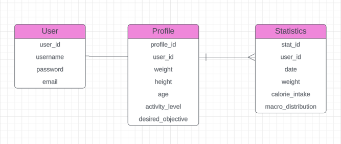

# Database Structure Overview

## Entities

### User
- **Attributes**:
  - `user_id` (PK)
  - `username`
  - `password`
  - `email`
- **Relationships**:
  - One-to-One with Profile
  - One-to-Many with Statistics

### Profile
- **Attributes**:
  - `profile_id` (PK)
  - `user_id` (FK)
  - `weight`
  - `height`
  - `age`
  - `activity_level`
  - `desired_objective`
- **Relationships**:
  - One-to-One with User

### Statistics
- **Attributes**:
  - `stat_id` (PK)
  - `user_id` (FK)
  - `date`
  - `weight`
  - `calorie_intake`
  - `macro_distribution`
- **Relationships**:
  - Many-to-One with User

## Relationships

- A **User** has one **Profile**.
- A **User** can have many **Statistics** records.

## ERD Diagram

