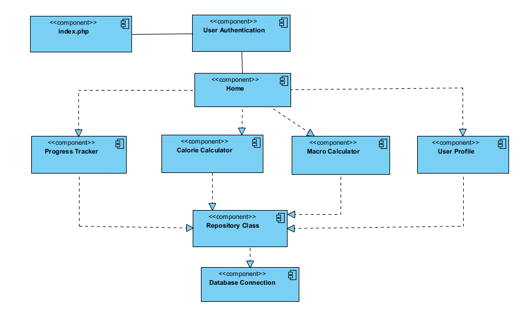

## Main Components Diagram

**Purpose:** To detail the key components within the system and their interactions.

**Diagram Type:** Component Diagram

**Components:**
- `index.php`
- User Authentication
- Calorie Calculator
- Macro Calculator
- Progress Tracker
- User Profile
- Repository Class
- Database Connection

**Description:**
- **index.php:** Serves as the main entry point for the application.
- **User Authentication:** Handles login, logout, and session management.
- **Calorie Calculator:** Calculates caloric needs based on user data.
- **Macro Calculator:** Computes macro nutritional needs for different goals.
- **Progress Tracker:** Allows users to log and view their progress.
- **User Profile:** Manages and updates user information.
- **Repository Class:** Acts as an intermediary between the application and the database.
- **Database Connection:** Manages interactions with the database.

**Diagram:**

