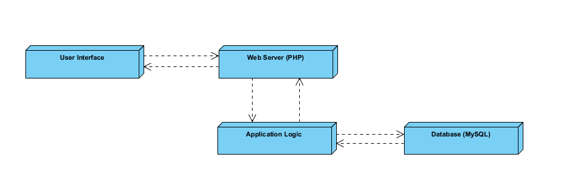

# Overall System Architecture

To provide a high-level view of the system, including its major components and their interactions.

## Diagram Type: Deployment Diagram

### Nodes:
- **User Interface**
- **Web Server (PHP)**
- **Application Logic**
- **Database (MySQL)**

### Description:
- **User Interface**: Web browsers accessing PHP pages.
- **Web Server**: Hosts PHP scripts and serves web pages.
- **Application Logic**: PHP classes handling calculations and business logic.
- **Database**: MySQL database storing user data, profiles, and statistics.

### Diagram
